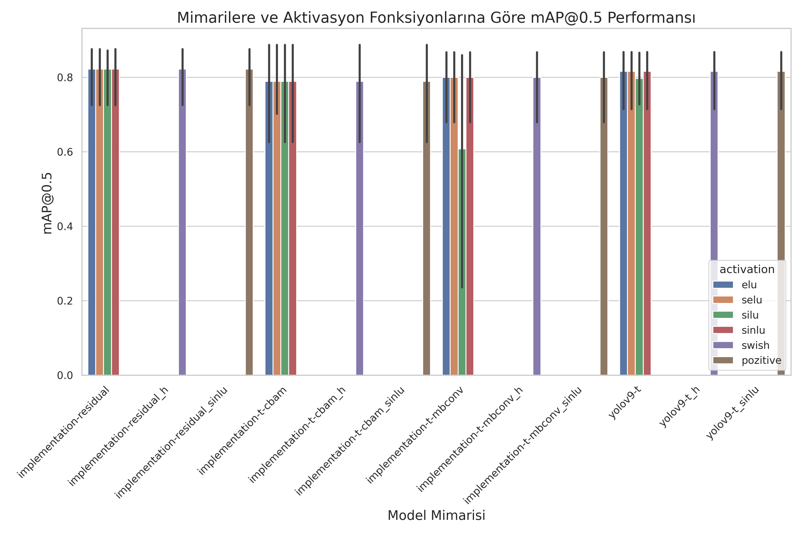

# YOLOv9 Model Training Analysis

Bu proje, YOLOv9 mimarisi ve çeşitli özel mimari varyasyonları üzerinde yapılan eğitim deneylerinin kapsamlı analizini sunar. Sonuçlar, farklı aktivasyon fonksiyonları ve optimizasyon algoritmalarının model başarımı üzerindeki etkilerini karşılaştırmalı tablolar ve görsellerle ortaya koyar.

## İçerik
- [Model Karşılaştırma Tabloları](#model-karşılaştırma-tabloları)
- [Eğitim Sonuçları ve Analizler](#eğitim-sonuçları-ve-analizler)
- [Görsel Analizler](#görsel-analizler)
- [Öneriler ve Gelecek Çalışmalar](#öneriler-ve-gelecek-çalışmalar)

---

## Model Karşılaştırma Tabloları

### En İyi Modeller

Aşağıdaki tablo, en iyi sonuç veren modellerin özetini sunar:

| Model Mimarisi | Aktivasyon | Optimizasyon | Model Boyutu (MB) | mAP@0.5 | mAP@0.5:0.95 | Kesinlik | Hassasiyet | En İyi Epok | Toplam Epok | Box Loss | Cls Loss | DFL Loss |
|---------------|------------|--------------|-------------------|---------|--------------|----------|------------|------------|-------------|----------|----------|----------|
| implementation-t-cbam | elu | SGD | 7.59 | 0.8875 | 0.6265 | 0.8363 | 0.8869 | 94 | 100 | 1.7613 | 1.3646 | 1.6064 |

Daha fazla detay için `runs/analysis/best_models.md` ve `runs/analysis/model_comparison_table.md` dosyalarına bakabilirsiniz.

---

## Eğitim Sonuçları ve Analizler

Eğitim sürecinde farklı mimariler, aktivasyon fonksiyonları ve optimizasyon algoritmaları test edilmiştir. Bazı öne çıkan bulgular:

- **En iyi genel başarı**: YOLOv9-t + silu + Adam
- **En iyi özel mimari**: implementation-t-cbam + elu + SGD
- **Aktivasyon fonksiyonu olarak silu ve sinlu_pozitive öne çıkıyor.**
- **Adam optimizasyonu genellikle daha hızlı ve yüksek başarı sağladı.**

### Performans Karşılaştırma Tablosu

| Model Architecture | Activation Function | Optimizer | mAP@0.5 | mAP@0.5:0.95 | Best Epoch |
|-------------------|---------------------|-----------|---------|--------------|------------|
| YOLOv9-t          | silu                | Adam      | 0.74049 | 0.34523      | 26         |
| YOLOv9-t          | h_swish             | LION      | 0.39367 | 0.15517      | 29         |
| Implementation-t-cbam | silu            | LION      | 0.02042 | 0.00597      | 23         |
| Implementation-t-mbconv | selu          | SGD       | 0.26264 | 0.08486      | 28         |
| Implementation-residual | sinlu_pozitive | SGD     | 0.39805 | 0.11068      | 25         |

### Kayıp (Loss) Karşılaştırması

| Model Architecture | Activation Function | Optimizer | Final Box Loss | Final Cls Loss | Final DFL Loss |
|-------------------|---------------------|-----------|----------------|----------------|----------------|
| YOLOv9-t          | silu                | Adam      | 2.766          | 2.1766         | 2.0413         |
| YOLOv9-t          | h_swish             | LION      | 3.067          | 2.6317         | 1.8960         |
| Implementation-t-cbam | silu            | LION      | 3.446          | 2.7518         | 2.2324         |
| Implementation-t-mbconv | selu          | SGD       | 3.880          | 3.0730         | 3.1384         |
| Implementation-residual | sinlu_pozitive | SGD     | 3.3154         | 2.6897         | 2.7468         |

Daha fazla detay ve istatistiksel analiz için `runs/analysis/train.md` dosyasına bakabilirsiniz.

---

## Görsel Analizler

Aşağıdaki görseller, eğitim sürecinin çeşitli yönlerini özetlemektedir:

- 
- 
- 
- 
- 

---

## Öneriler ve Gelecek Çalışmalar

- En iyi sonuçlar için YOLOv9-t mimarisi ve silu aktivasyon fonksiyonu ile Adam optimizasyonu önerilir.
- Aktivasyon fonksiyonları ve optimizasyon algoritmalarında daha fazla kombinasyon denenebilir.
- Eğitim süresi ve veri artırma teknikleriyle ilgili yeni stratejiler test edilmelidir.
- Farklı veri kümelerinde genelleme yeteneği incelenmelidir.

Daha fazla detay ve öneri için `runs/analysis/train.md` dosyasındaki "Recommendations for Future Experiments" bölümüne bakabilirsiniz.

---

## API Endpointleri

Bu dosya, Flask tabanlı bir REST API servisidir ve model ile görsel tabanlı tespit işlemlerini arka planda subprocess ile çalıştırır. MongoDB ile entegre çalışır.

### Temel Endpointler

- **/detect [POST]**: Model adı, kullanıcı ve hasta bilgisi ile bir görsel alır, ilgili modeli kullanarak tespit yapar ve sonucu MongoDB'ye kaydeder. Sonuç olarak tespit edilen kutuları ve anotasyonlu görselin URL'sini döner.
- **/models [GET]**: Eğitimli modelleri listeler.
- **/tmp/<filename> [GET]**: Geçici olarak kaydedilen anotasyonlu görselleri sunar.
- **/ [GET]**: Ana sayfa olarak statik bir HTML dosyası sunar.

**Not:** Tüm tablo ve görsellerin detayları için ilgili md dosyalarını ve `visualizations` klasörünü inceleyiniz.
